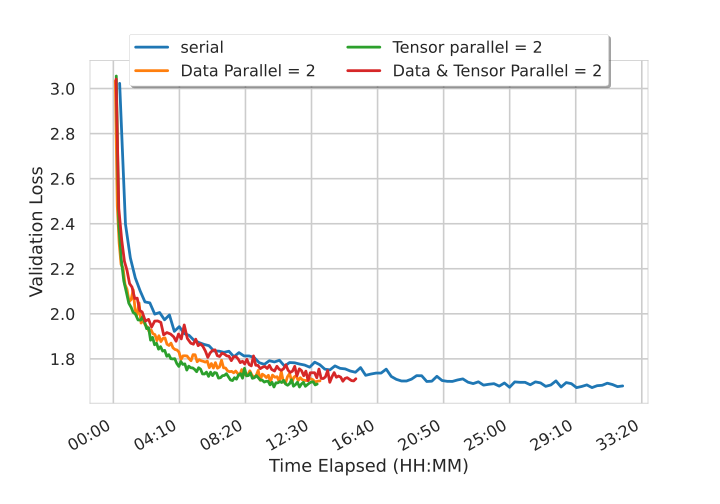

<h1 align="center">🐌 NuMPItron</h1>

Simplistic small language model 3D-parallelism training using NumPy and MPI. Inspired by [Megatron-LM](https://github.com/NVIDIA/Megatron-LM) and [Nanotron](https://github.com/huggingface/nanotron) and based only on [NumPy](https://numpy.org) and [MPI for Python](https://mpi4py.readthedocs.io), NuMPItron offers a variety of ways to train your Transformer at a snail's pace.

This library is meant as a learning experience for implementing distributed training strategies. Ideally the library will be capable of both 3D parallelism (TP + MP + DP) and ZeRO. If you want to follow along, make sure to check out my [blog](https://lweitkamp.github.io/).

# Feature Roadmap
Core functionality will be 3D parallel with some decoding strategies:

* [x] Single Core 
* [x] Tensor Parallel
* [x] Distributed Data Parallel
* [ ] Pipeline Parallel
* [ ] Distributed sampling strategies

When/if this is done, we will look at expert parallel strategies.


# Installation
First, ensure `mpi4py` is installed by following the instructions on the [MPI for Python](https://mpi4py.readthedocs.io) page.

Then, install the library using:

```bash
git clone https://github.com/lweitkamp/numpitron
cd numpitron
pip install -e .  # -e .[dev] for unit tests
```

# Training
You will need to download the shakespeare dataset (`shakespeare_char_{train|val}.bin`) from [Google Drive](https://drive.google.com/drive/folders/1VwFHJ8z7EmjTJZv4XsISTyPwwpELyMOs?usp=sharing) and place it in the `data` folder.

Training with tensor/data parallelism can be done using the `train_shakespeare.py` script:
```bash
mpirun -n {1, 2, ...} python train_shakespeare.py \
    --tensor-parallel-size {1, 2, ...} \
    --data-parallel-size {1, 2, ...}
```

Make sure that the product of `--{tensor, data}-parallel-size` is equal to `-n`. Parameters and optimizer state will be stored at `data/model.npy` to be used for sampling. Training takes about 12 hours for `--tensor-parallel-size 2` and 32 hours without tensor parallel, reaching a loss of about ~1.80[^1] after a couple of hours, depending on your hardware (I'm using a 2015 macbook pro):



Note that the graph above only implies that on CPU you are better off performing smaller matmuls (data/tensor parallel combinations).
This makes sense given that you are compute bound quite easily on the CPU.


# Sampling
Run a sample generation using the following:

```bash
mpirun -n {1, 2, ...} python sample.py \
    --sampler {greedy, softmax} \
    --tensor-parallel-size {1, 2, ...} \
    --data-parallel-size {1, 2, ...}
```

With the pretrained model loaded you would expect to see the following text below. Not bad, not great.

```
Seecon:
Commendom:
Who tear pout mine so I profit in.

BRUTUS:
Why, bear are dreadful he gnot letted and Chrown.

AUFIDIUS:
The may my heart, John my moone, with have glo:
But the bluike to ther opeesusate! Camille,
A marin curstifies will to a lise
```

[^1]: This matches Karpathy's log loss at same model size at his [NanoGPT](https://github.com/karpathy/nanoGPT?tab=readme-ov-file#quick-start) repo.
